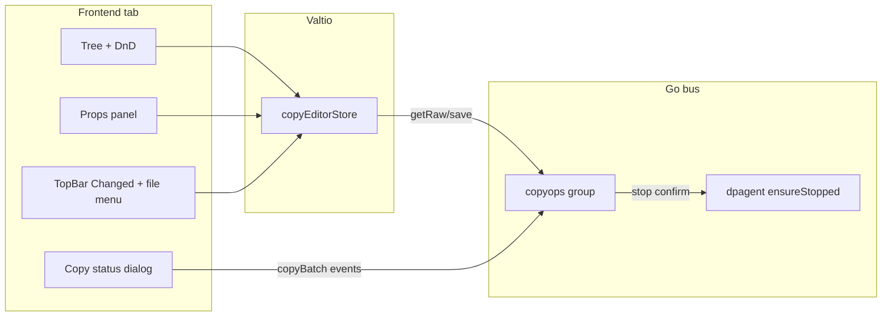

# Copy Operations Tab

## Decisions (locked)

- Persistence: backend-owned `copy.json` (same search/write pattern as `tools.json`) + localStorage cache; toolbar also Import/Export arbitrary JSON.
- Elevation: if required and app is not elevated → prompt relaunch via existing `settingsBus.requestElevationRestart()`, then abort (user re-runs Copy after restart).
- Tree: flat only — fixed root **Groups** → **Group** → **copy item** (single source file → destination folder).
- Group copy: stop DpAgent **once** before the batch when the effective stop flag is set; run children sequentially.
- Flag precedence: group flags win for group Copy; single-item Copy uses that item’s flags only.
- Path fields: typeable + Windows browse dialog + drag-and-drop onto the field.
- Copy controls: on each operation row in the tree **and** in the right props panel (group and item).

## Architecture



## Data model

New types in [`frontend/src/components/2-main/5-tab-copy-operations/a-atoms/9-types-copy.ts`](frontend/src/components/2-main/5-tab-copy-operations/a-atoms/9-types-copy.ts):

```ts
type CopyOpItem = {
  sourceFile: string;
  destFolder: string;
  stopDpAgent?: boolean;
  requireElevated?: boolean;
  uid?: string; // editor-only
};

type CopyGroup = {
  name: string;
  stopDpAgent?: boolean;
  requireElevated?: boolean;
  items: CopyOpItem[];
  uid?: string;
};

type CopyConfig = {
  // Fixed root "Groups"; only groups[] is persisted
  groups: CopyGroup[];
};
```

Serialize strips `uid`; dirty = canonical JSON ≠ `baseline` (same idea as [`6-json-serialize-dirty.ts`](frontend/src/components/2-main/3-tab-tools-menu-editor/a-atoms/6-json-serialize-dirty.ts)). Badge label: **Changed** (not “unsaved”).

## Frontend layout (isolated folder)

Create [`frontend/src/components/2-main/5-tab-copy-operations/`](frontend/src/components/2-main/5-tab-copy-operations/) mirroring Tools Menu Editor split:

| Area | Files |
|------|--------|
| Page shell | `0-editor/0-all-editor.tsx` — TopBar + resizable tree/props |
| Toolbar | `0-editor/1-1-top-bar.tsx` — status, **Changed**, menu: Reload / Import… / Export… / Reset / Apply |
| Tree + DnD | `0-editor/2-0-panel-tree.tsx` — reuse HTML5 DnD patterns from tools editor; root not draggable/deletable |
| Tree ops menu | `0-editor/2-1-tree-menu.tsx` — top-right: Add Group, Add Copy Item, Delete |
| Props | `0-editor/3-0-panel-props.tsx` + `3-1-props.tsx` — group vs item editors + Copy button |
| Path field | `0-editor/path-input.tsx` — text + browse + drop target |
| Status dialog | `0-editor/4-copy-status-dialog.tsx` — one line per item: source filename, dest folder, status (`skipped` / `copied` / `failed` + error icon tooltip) |
| State | `a-atoms/` — Valtio store, mutations, load/save/cache, serialize/dirty, defaults, selection hook |

Register tab in [`frontend/src/components/0-all/8-pages-array.tsx`](frontend/src/components/0-all/8-pages-array.tsx) as `{ id: "copy-operations", label: "Copy Operations", Page }` (before Demos so it appears in View menu’s first five, or extend `VIEW_MENU_ITEMS` to include it). Add `PANEL_GROUPS.copyEditorMain` in [`frontend/src/store/2-panel-sizes.ts`](frontend/src/store/2-panel-sizes.ts).

State: **Valtio** for the document (match Tools Menu Editor); local React state for dialog open/progress UI; reuse `settingsBus` / existing elevation atoms where needed. No new Jotai store unless it already fits an existing pattern.

### Tree UX

- Root label **Groups** (fixed).
- Group nodes: name; drop before/after/inside (inside = nest item into group).
- Item nodes: show short source filename; row-end **Copy** icon button.
- DnD rules: cannot move root; cannot nest groups under groups; items only under groups; moving a group reorders among groups.

### Props panels

- **Group selected:** name input; checkboxes Stop DpAgent / Require elevated; **Copy** (runs all children).
- **Item selected:** source file + dest folder path inputs; same two checkboxes; **Copy** (runs that item).
- **Root selected:** brief help / no edit fields (or disabled name “Groups”).

### Persistence

- Load cascade (like tools): disk `copy.json` → localStorage cache → defaults.
- `subscribe` → write localStorage + recompute dirty.
- Apply → `copyOpsBus.save(text)` → update baseline, clear Changed.
- Import: OpenFileDialog (JSON) → parse into store, set as new baseline or mark dirty vs disk (treat imported text as new baseline only after Apply; until then Changed if ≠ disk baseline — simplest: Import replaces config and sets baseline to imported text so Changed clears, then edits dirty again; Reload restores disk).
- Export: SaveFileDialog default `copy.json`.

Bridge: [`frontend/src/bridge/groups/copyops.ts`](frontend/src/bridge/groups/copyops.ts) + export from bridge index.

## Backend

### 1. New package `backend/copyops/`

Mirror `toolsmenu` conventions:

- `types.go` — `Group = "copyops"`, DTOs, progress event name `copyops:itemStatus`
- `config.go` — find/write `copy.json` (`TRAYTOOLS_COPY` env override; same candidate order as tools, filenames `copy.json`)
- `manager.go` — `Register`: `getRaw`, `save`, `pickFile`, `pickFolder`, `copyBatch` (starts work; returns immediately with job id)
- `copy_windows.go` / `copy_other.go` — single-file copy:
  - If dest file exists and size + modtime match source → status `skipped`
  - Else copy (create dest dir if needed) → `copied` or `failed` + error string
- Progress: `runtime.EventsEmit` per item (tracemanager pattern), so the bus mutex is not held for the whole batch
- Dialog helpers: wrap Wails `OpenFileDialog` / `OpenDirectoryDialog` / `SaveFileDialog`

Wire in [`backend/app.go`](backend/app.go) `NewApp` + `Startup` (pass ctx for events).

`copyBatch` payload shape:

```go
type CopyBatchRequest struct {
  StopDpAgent bool `json:"stopDpAgent"`
  RequireElevated bool `json:"requireElevated"`
  Items []struct {
    SourceFile string `json:"sourceFile"`
    DestFolder string `json:"destFolder"`
  } `json:"items"`
}
```

Flow in runner:

1. If `RequireElevated` && !`IsElevated()` → emit failure for job / return error code `needsElevation` (frontend prompts relaunch; does not start dialog progress as success path).
2. If `StopDpAgent` → call new dpagent ensure-stopped helper; on failure emit/fail.
3. For each item: copy + emit `{ sourceFile, destFolder, status, error? }`.
4. Emit job complete.

### 2. DpAgent copy-related stop (separate file)

In [`backend/dpagent/`](backend/dpagent/), add e.g. `copy_ops_stop.go` (name makes ownership clear):

- `EnsureStopped(timeout)` — if already stopped, ok; else `platformStop()`, then poll `platformGetStatus()` until not running or timeout.
- Register bus command `ensureStopped` on existing `dpagent` group (used by copyops and optionally frontend).

Do **not** put file-copy logic in dpagent; only stop confirmation lives there.

## Copy execution (frontend)

Shared runner used by tree-row Copy, props Copy (item), and props Copy (group):

1. Compute effective flags (group vs item).
2. If elevated required and `!isElevated` → confirm dialog → `requestElevationRestart()` → return.
3. Open status dialog with pending rows for each item.
4. Call `copyOpsBus.copyBatch({ stopDpAgent, requireElevated, items })`.
5. Subscribe to `copyops:itemStatus` / complete events; update rows (`skipped` / `copied` / `failed` + tooltip on failure icon).
6. Close/dismiss when job completes (user can close after finish).

## Path input details

- Browse file → `copyOpsBus.pickFile()`; browse folder → `pickFolder()`.
- Drag-and-drop: Wails `OnFileDrop` / drop-target on the input wrapper (enable file drop in Wails options if not already); take first dropped path; for folder field, accept directories only when possible.
- Manual typing always allowed.

## Out of scope

- Nested groups, folder→folder recursive copy, concurrent multi-job copy UI.
- Changing Tools Menu Editor behavior.