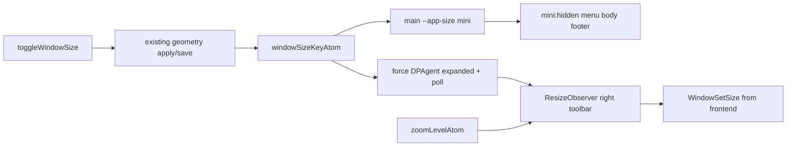

# Mini window chrome via container queries

## Approach

- **UI visibility (frontend only):** `windowSizeKeyAtom` sets `--app-size` on the app `@container`; Tailwind `mini:` uses a **container style query**; menu, main body, and footer use `mini:hidden`.
- **DPAgent in mini:** always expanded and monitored, regardless of `appSettings.showDpAgentToolbar`.
- **Window geometry:** mini width/height are recalculated on the **frontend** from the live right-side toolbar (Exit may appear/disappear; DPAgent expanded width; zoom). Apply via Wails `WindowSetSize` (existing runtime API).
- **Backend:** **no mini-specific changes.** `toggleWindowSize` / save/restore keep storing full `X/Y/Width/Height` for mini exactly like any other size key. Other size keys remain unaffected.



## Frontend

### 1. Tailwind `mini:` variant

In [`frontend/src/index.css`](frontend/src/index.css):

```css
@custom-variant mini (@container style(--app-size: mini));
```

### 2. App shell as container

In [`frontend/src/components/0-all/0-app.tsx`](frontend/src/components/0-all/0-app.tsx):

- Read `windowSizeKeyAtom`.
- On `<main>`: `@container` + style `--app-size: mini | normal`.
- Main body wrapper and footer: `mini:hidden`.
- Grid: `mini:grid-rows-[auto]` so only the header row remains.

Keep `AllDialogs` / toaster mounted so Settings etc. still work from the mini toolbar.

### 3. Header chrome + forced DPAgent + live sizing

In [`frontend/src/components/1-header/0-all-header/0-all-header.tsx`](frontend/src/components/1-header/0-all-header/0-all-header.tsx):

- Left cluster (menubar, tabs, unload notice): `mini:hidden`.
- Right toolbar stays (window size, stay-on-top, settings, home, theme if enabled, DPAgent, Exit if shown, integrity).
- Header flex: `justify-between mini:justify-end` so the toolbar fills the mini window.
- `ref` on the **right-side controls** container.
- While `windowSizeKeyAtom === "mini"`:
  - `ResizeObserver` (+ `zoomLevelAtom` / zoom changes) measures that node.
  - Convert layout size → window DIPs using zoom factor (`1.2^level`) and non-client chrome (`outerHeight - innerHeight`, and width chrome if needed).
  - Call Wails runtime `WindowSetSize(w, h)` (debounce during DPAgent expand animation). Position is left alone; backend already applied/saved it via the normal size-key flow.

In [`frontend/src/components/1-header/4-dpagent-toolbar/0-all-dpagent-toolbar.tsx`](frontend/src/components/1-header/4-dpagent-toolbar/0-all-dpagent-toolbar.tsx):

- Effective expand/monitor: `isMini || appSettings.showDpAgentToolbar`.
- In mini: controls always visible, 1s poll always active; status-icon toggle must not collapse the toolbar.
- Leaving mini: normal respect for `showDpAgentToolbar` again.

## Backend

**None.** No new commands, no special mini X/Y-only persistence, no changes to `defaultWindowSize` / `SetWindowSizeKeyOption` / save paths for this feature. Existing toggle + geometry persistence continue to work for all keys, including mini.

## Out of scope

- Backend / options.go changes for mini.
- Special layout logic for non-`mini` keys.
- Changing which optional right-side buttons exist beyond forcing DPAgent expanded in mini.
