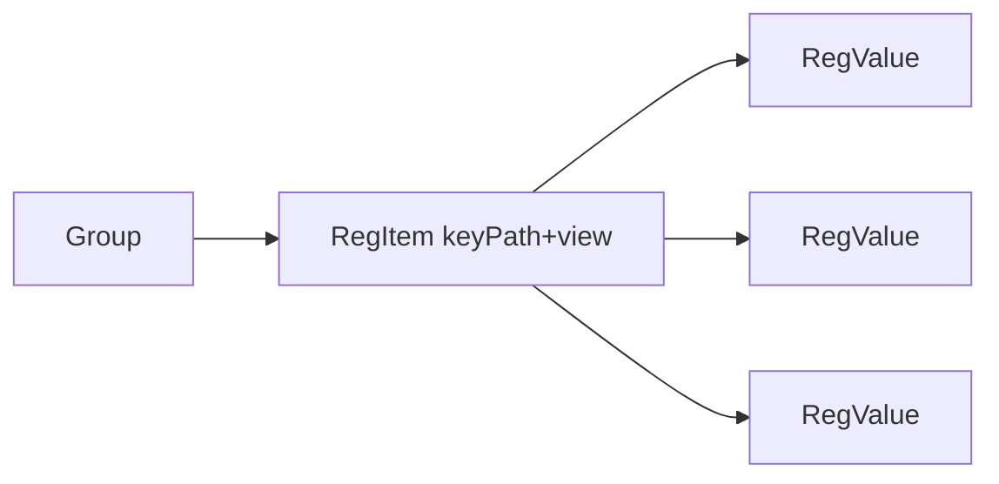

# Multi-value registry keys

## Decisions (locked)

- **Tree:** one leaf per key path (`RegItem`); selecting it edits all values in a table.
- **Ownership:** key owns `keyPath`, `view`, `requireElevated`, `comment`, `name`; each value owns `valueName`, `valueType`, `newValue` (+ runtime `uid`).
- **DnD:** Motion `Reorder.Group` / `Reorder.Item` from `motion/react` (already on `motion@^12`).
- **Empty keys:** always keep at least one value row (delete disabled when `values.length === 1`).
- **State:** continue mutating the existing Valtio `registryEditorStore` + Jotai async ops atoms; no React `useState` for the values list.

## New data shape

```ts
type RegValue = {
  valueName: string;       // "" = (Default)
  valueType: RegValueType;
  newValue: string;
  uid?: string;            // runtime only
};

type RegItem = {
  keyPath: string;
  values: RegValue[];      // length >= 1
  name?: string;
  view?: RegView;
  requireElevated?: boolean;
  comment?: string;
  uid?: string;
};
```

Persisted JSON example:

```json
{
  "keyPath": "HKLM\\SOFTWARE\\_tm_test",
  "view": "32",
  "values": [
    { "valueName": "tm_test", "valueType": "REG_DWORD", "newValue": "12345" },
    { "valueName": "", "valueType": "REG_SZ", "newValue": "hello" }
  ]
}
```



## Migration / normalize

In [`6-json-serialize-dirty.ts`](frontend/src/components/2-main/6-tab-registry/a-atoms/6-json-serialize-dirty.ts) `normalizeItem`:

- If `values` is a non-empty array → normalize each entry; strip legacy top-level `valueName` / `valueType` / `newValue`.
- Else if legacy flat fields present → wrap into `values: [{ valueName, valueType, newValue }]`.
- Else → `values: [{ valueName: "", valueType: "REG_SZ", newValue: "" }]`.

Serialize: strip value `uid`s; never emit flat value fields on the item. Update `derivedItemLabel` / `itemLabel` to key-centric (custom `name`, else key leaf, else `"(no key)"`).

Update [`tools/registry.json`](tools/registry.json) to the new shape (and any samples/docs that show flat items).

## Core model helpers

In [`9-types-registry.ts`](frontend/src/components/2-main/6-tab-registry/a-atoms/9-types-registry.ts):

- Add `RegValue`, `createValue()`, change `createItem()` to `{ keyPath, values: [createValue()], ... }`.
- `assignUids` / `cloneItem` / `reassignNodeUids`: assign uids to nested values.
- Add `findValueByUid(config, uid)` (and extend `findByUid` or parallel lookup) so ops can resolve a value → parent item.
- Add `collectItemValues` / change `collectGroupItems` consumers that need runnable specs to flatten `item.values` into `{ item, value }` targets (or a thin `RegValueRef` helper).

## Ops layer

In [`2-run-registry.ts`](frontend/src/components/2-main/6-tab-registry/a-atoms/2-run-registry.ts):

- `toSpec(item, value)` uses key fields from item + value fields from `RegValue`.
- Read cache stays `registryReadStore.byUid[value.uid]`.
- **Item-level** Read/Write (header + tree hover): all values under the key.
- **Value-level** Read/Write (row icons): single value uid — new thin wrappers or overload existing atoms.
- Progress rows / match checks use the value + parent key for labels.

Backend / bridge `RegValueSpec` unchanged (still one value per call); only the frontend packing changes.

## .reg import / export

[`7-reg-file-format.ts`](frontend/src/components/2-main/6-tab-registry/a-atoms/7-reg-file-format.ts):

- **Import:** while parsing a `[KEY]` section, accumulate value lines into one `RegItem` with `values[]` (one item per key section, not one item per value). Different keys → different items. Preserve existing warnings for deletions/unsupported types.
- **Export:** flatten each item’s `values` into value lines under that key; group by key+view as today (update `formatValueLine` to take a value + shared key context).
- Update [`7-reg-file-format.test.ts`](frontend/src/components/2-main/6-tab-registry/a-atoms/7-reg-file-format.test.ts) for multi-value-per-item round-trips.

## Tree / editor mutations

[`1-registry-editor-atoms.ts`](frontend/src/components/2-main/6-tab-registry/a-atoms/1-registry-editor-atoms.ts) + tree panel:

- “Add item” still adds a key node (one default value).
- Remove “add sibling copies keyPath for another value” mental model — adding another value is an in-table action.
- Tree label = `itemLabel` (key-centric). Tooltip can stay `fullKeyPath`.
- Hover write on a key writes **all** of its values.

## Props UI

Rewrite the red-box section in [`3-3-props-item.tsx`](frontend/src/components/2-main/6-tab-registry/0-editor/3-props/3-3-props-item.tsx) (likely extract `3-5-props-item-values-table.tsx`):

Keep above the table: Comment, Key path + View, elevated, Display name, header Read/Write actions.

**Values table columns:** drag handle | Value name | Value type | New value | Current value (+ Matches/Differs) | Read icon | Write icon | Delete icon.

- Row reorder: `Reorder.Group` / `Reorder.Item` with drag handle via `useDragControls` + `dragListener={false}` so inputs stay editable.
- Add value button below/above table → `createValue()` pushed onto `item.values`.
- Delete → splice; disabled at length 1.
- Inputs patch Valtio through `patchSelectedItem` / a `patchValue(uid, fn)` helper.
- Compact controls to fit a row (type select, short inputs); multiline types (`REG_MULTI_SZ` / `REG_BINARY`) use a small textarea or expand-on-focus — keep row height reasonable.

Also update [`3-4-quick-list.tsx`](frontend/src/components/2-main/6-tab-registry/0-editor/3-props/3-4-quick-list.tsx) and any other `valueName`/`newValue`-on-item assumptions (grep-driven sweep).

## Implementation order

1. Types + create/clone/uid helpers + label helpers  
2. JSON normalize/serialize + migrate sample `registry.json`  
3. Flatten helpers + ops (`toSpec`, read store by value uid, item vs value atoms)  
4. .reg parse/build + tests  
5. Props values table (Motion Reorder) + wire header/row actions  
6. Tree/quick-list/add-item polish + grep cleanup of leftover flat-field usage

## Out of scope

- Changing Go bridge batch APIs  
- Uniqueness enforcement on `(valueName)` within a key (allow duplicates, same as today across siblings)  
- Nested value folders in the tree (values only appear in the props table)
