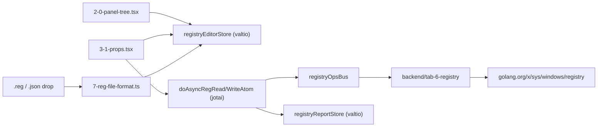

# Registry Tab

## Approach

The three existing editor tabs (Copy Operations, Sync, Tools Menu) are near-identical in structure, and Copy Operations is the closest match to what's needed here. The Registry tab follows it line-for-line: a Valtio `registryEditorStore` holding `{ config, rootUid, selectedUid, baseline, dirty, ... }`, a custom recursive tree with HTML5 drag-and-drop, a props pane switching on root/group/item, and a bottom report panel. New behavior is confined to the registry I/O layer and the `.reg` file format.

Per the answers given: writes go to the live registry behind an explicit per-item "Write" button and a group-level "Write all"; `.reg` export emits the desired values authored in the tree; the type selector covers `REG_SZ`, `REG_EXPAND_SZ`, `REG_DWORD`, `REG_QWORD`, `REG_BINARY`, `REG_MULTI_SZ`; and the layout includes a bottom results panel.

Following the codebase's documented split, Valtio owns the editable tree and the transient read/write results, while Jotai owns discrete UI state and the async action atoms (`doAsync*Atom` convention, as in [9-types-confirmation.ts](frontend/src/components/4-dialogs/8-1-confirmation/9-types-confirmation.ts)).



## Backend: `backend/tab-6-registry/`

New package registered on the bus as group `registryops`, wired in [backend/app.go](backend/app.go) alongside `copyops`/`syncops` (field, `New()`, `Register(a.bus)`, `Start(ctx)`).

- `config.go` — verbatim adaptation of [backend/tab-1-copyops/config.go](backend/tab-1-copyops/config.go) with `registry.json` and `TRAYTOOLS_REGISTRY`.
- `manager.go` — `getRaw`, `save`, `importPath`, `exportPath`, `readTextFile`, `writeTextFile`, `readBatch`, `writeBatch`, `jump`. Dialog filters add `Registry files (*.reg)` next to `JSON (*.json)`.
- `registry_windows.go` / `registry_other.go` (`//go:build !windows` stub returning an error, since `wails build --platform darwin` is a script).

Two details that differ from the copyops manager and matter:

- **Encoding.** `.reg` files written by regedit are UTF-16LE with a BOM and CRLF line endings. `readTextFile` must sniff the BOM and decode UTF-16LE to UTF-8; `writeTextFile` must re-encode to UTF-16LE with BOM and CRLF when the target is `.reg`. Plain `os.ReadFile`/`os.WriteFile` as used by copyops would mangle them.
- **Sync batches, not events.** Copy uses `EventsEmit` progress because file copies are slow. Registry reads/writes are effectively instant, so `readBatch`/`writeBatch` return their per-item result arrays directly. This avoids the whole subscribe-before-dispatch dance in [2-run-copy.ts](frontend/src/components/2-main/1-tab-copy-operations/a-atoms/2-run-copy.ts).

Hive and view resolution reuses the table already in [backend/winregedit/jump_windows.go](backend/winregedit/jump_windows.go); the 32/64-bit view maps to `registry.WOW64_32KEY` / `WOW64_64KEY`, matching the existing usage in the trace-manager categories code. `jump` simply calls `winregedit.Jump()` so an item can open regedit at its key.

Values cross the bridge as strings in a canonical text form so the JSON config stays readable and round-trips through `.reg`: decimal or `0x` hex for DWORD/QWORD, comma-separated hex bytes for BINARY, newline-separated for MULTI_SZ. Go parses and formats.

## Bridge

New `frontend/src/bridge/groups/registryops.ts` following [copyops.ts](frontend/src/bridge/groups/copyops.ts), exporting `registryOpsBus` plus `RegHive`, `RegValueType`, `RegView`, `RegReadResult`, `RegWriteResult` types; re-exported from [frontend/src/bridge/index.ts](frontend/src/bridge/index.ts).

## Frontend: `frontend/src/components/2-main/6-tab-registry/`

### `a-atoms/`

- `9-types-registry.ts` — data model plus the full set of helpers adapted from [9-types-copy.ts](frontend/src/components/2-main/1-tab-copy-operations/a-atoms/9-types-copy.ts) (`ensureUids`, `createGroup`/`createItem`, `cloneGroup`/`cloneItem`, `collectGroupItems`, `containsGroup`, `findByUid`, and the selection-path helpers that survive uid reseeding across elevation restarts).

```ts
export type RegItem = {
    name?: string;          // display label; falls back to valueName or key leaf
    hive: RegHive;          // HKCU | HKLM | HKCR | HKU | HKCC
    keyPath: string;        // SOFTWARE\DigitalPersona\Tracing
    valueName: string;      // "" means (Default)
    valueType: RegValueType;
    newValue: string;       // desired value in canonical text form
    view?: RegView;         // curr | 32 | 64
    requireElevated?: boolean;
    uid?: string;
};
export type RegGroup = { name: string; items: RegNode[]; requireElevated?: boolean; view?: RegView; uid?: string; };
export type RegConfig = { groups: RegGroup[]; };
```

- `0-registry-local-storage.ts` — `registryEditorStore` proxy, `traytools-26__registry__v1.0` cache, and `RegistryConfig_Load/Save/Apply/CreateNew/Import/Export/RevealInExplorer`, mirroring [0-copy-local-storage.ts](frontend/src/components/2-main/1-tab-copy-operations/a-atoms/0-copy-local-storage.ts).
- `1-registry-editor-atoms.ts` — `addNode`, `removeNode`, `moveNode`, `copyNode`, `isRootUid` adapted from [1-copy-editor-atoms.ts](frontend/src/components/2-main/1-tab-copy-operations/a-atoms/1-copy-editor-atoms.ts), plus `addDroppedRegistryFiles(paths)` (see drag-and-drop below).
- `6-json-serialize-dirty.ts` — `buildRegistryFileText` / `parseRegistryJson` / `syncDirty`, stripping `uid` on serialize.
- `7-reg-file-format.ts` — `.reg` parse and serialize (see below).
- `8-default-config.ts`, `use-selected-node.ts` — direct adaptations; the hook keeps `useSnapshot(..., { sync: true })` so controlled inputs don't lose caret position.
- `2-run-registry.ts` — `registryReadStore` (transient `Record<uid, RegReadResult>`, not persisted) and `registryReportStore` (job rows for the bottom panel), plus the Jotai action atoms:
  - `doAsyncRegReadItemAtom`, `doAsyncRegReadGroupAtom`
  - `doAsyncRegWriteItemAtom`, `doAsyncRegWriteGroupAtom`
  - `confirmRegistryWritesAtom = atomWithStorage("reg.confirmWrites", true)`

  Writes reuse the elevation flow already proven in [2-run-copy.ts](frontend/src/components/2-main/1-tab-copy-operations/a-atoms/2-run-copy.ts): check `appIsElevatedAtom`, prompt with `doAsyncExecuteConfirmDialogAtom`, run `resolveDirtyTabsBeforeDestructiveAction()`, then `settingsBus.requestElevationRestart()`. New items default `requireElevated` to true for HKLM/HKCR/HKU. An access-denied failure re-offers the elevation prompt.

### `0-editor/`

- `0-all-editor.tsx` — `Page_Registry`, the same nested `ResizablePanelGroup` as [copy's 0-all-editor.tsx](frontend/src/components/2-main/1-tab-copy-operations/0-editor/0-all-editor.tsx): vertical editor/report split wrapping a horizontal tree/props split.
- `1-1-registry-toolbar.tsx` — file-info + Changed badge + actions menu, `Ctrl+S` via the shared `useCtrlSSave`. Import and Export each split into a JSON entry and a `.reg` entry.
- `2-0-panel-tree.tsx`, `2-1-tree-menu.tsx` — tree and add/delete menu.
- `3-0-panel-props.tsx`, `3-1-props.tsx` — root/group/item props. The item form holds: hive `Select`, key path `Input`, value name `Input`, type `Select` (six types), new-value field (a `Textarea` for MULTI_SZ, otherwise `Input`), registry-view `Select`, `requireElevated` checkbox, and a row of actions — **Read current**, **Write**, **Open in regedit**. The read-back result renders beneath as current type and value with a visual match/differs indicator against `newValue`.
- `3-2-quick-list.tsx` — same bordered, indented layout as [copy's quick list](frontend/src/components/2-main/1-tab-copy-operations/0-editor/3-2-quick-list.tsx), shown for root and group selections, with per-row Read and Write buttons and a group-level "Read all"/"Write all".
- `4-0-report-registry.tsx` — job rows with per-item outcome (read value, written / unchanged / failed, error text).

## `.reg` file format (`7-reg-file-format.ts`)

Parsing must cover what regedit actually emits:

- `Windows Registry Editor Version 5.00` and legacy `REGEDIT4` headers
- `[HKEY_LOCAL_MACHINE\SOFTWARE\Foo]` sections; `[-HKEY...]` key-deletion sections are skipped with a warning
- value forms: `"Name"="str"`, `@="default"`, `dword:0000000a`, `hex:de,ad`, `hex(2):` (EXPAND_SZ), `hex(7):` (MULTI_SZ), `hex(b):` (QWORD), and `"Name"=-` deletion (skipped with a warning)
- backslash line continuations, and `\\` / `\"` escapes inside strings
- `hex(2)`/`hex(7)` payloads decode from UTF-16LE bytes to text

Serialization writes the desired values grouped by key, UTF-16LE + BOM + CRLF.

## Drag-and-drop

Two independent mechanisms, both already solved in the copy tree:

1. **Internal reorder** — identical `DndContext` + before/inside/after logic, with MIME `application/x-traytools-registry-tree-uid`. Ctrl-drag copies.
2. **OS file drop** — `registerFileDropTarget` from [a-shared/path-input.tsx](frontend/src/components/2-main/a-shared/path-input.tsx) with `pathsKind: "file"`. Per the requirement, a dropped `.reg` or `.json` always produces a **new group** holding every element from that file, named after the file's basename, regardless of which row was hovered. `addDroppedRegistryFiles` reads each path via `registryOpsBus.readTextFile`, picks the parser by extension (falling back to content sniffing on the `Windows Registry Editor` / `REGEDIT4` header), appends the group, and selects it.

The copy tree's WebView2 workarounds carry over unchanged and are load-bearing: `pathsFromDataTransfer` is often empty so paths arrive later via Wails `OnFileDrop`, the drop handler must not `stopPropagation`, and the dedupe guard in `applyExternalFiles` prevents the same gesture being applied twice.

## App wiring

- [8-pages-array.tsx](frontend/src/components/0-all/8-pages-array.tsx) — import `Page_Registry`, add `{ id: "registry", label: "Registry", Page: Page_Registry }` to `MAIN_PAGES`, and add `"registry"` to `ID_FOR_TOPMENU`, `ID_FOR_QUICKTABS`, and `ID_FOR_WELCOME`.
- [2-panel-sizes.ts](frontend/src/store/2-panel-sizes.ts) — add `registryEditorMain: 'registry-editor.main'` and `registryEditorVertical: 'registry-editor.vertical'` with `{ tree: 42, props: 58 }` and `{ editor: 72, report: 28 }` defaults.
- [a-quit-unsaved.ts](frontend/src/components/0-all/a-quit-unsaved.ts) — add a `"Registry"` entry to `collectDirtyTabs()` calling `RegistryConfig_Apply`.

## Verification

`wails dev` (or `go build ./...` plus `pnpm --dir frontend build`) must compile. Manual pass: create a group and item, read an existing `HKCU` value, edit and write it back, confirm the change in regedit, export to `.reg`, drop that file back onto the tree and confirm a new group appears with the same items, then round-trip through JSON export/import.