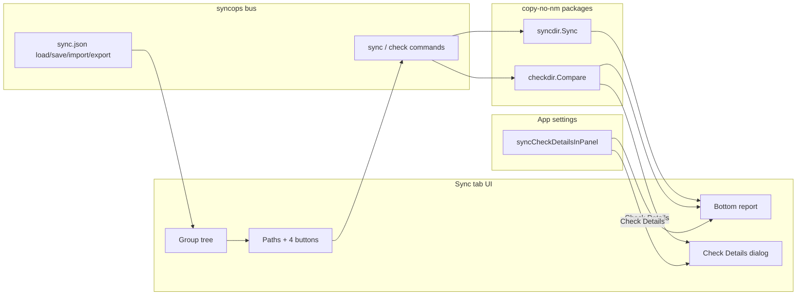

# Sync Tab in traytools-26

## Decisions (locked)

- Reuse CLI via **Go module + `replace`** to `[../to-copy-no-nm-cli](C:\y\w\2-web\0-dp\utils\to-copy-no-nm-cli)` — do **not** spawn `copy-no-nm.exe`
- Config leaf = **folder pair** (`sourceFolder` / `destFolder`); managed file = `**sync.json`**
- **Nested groups:** each group’s `items` is an ordered list of sync items **and** nested groups (same tree model as Copy Operations; nesting unlimited)
- Actions only: **Sync →**, **Sync ←**, **Check**, **Check Details** (no `-f` / `-g`; always `CopyGit=false`)
- **No** `stopDpAgent` / `requireElevated` / `renameLocked`
- Run **selected item only** (no parent/top-level group sync buttons)
- Destructive sync deletes use CLI Recycle Bin path (same as `syncdir`)
- **React state:** use **Valtio** (editor document, report jobs, `appSettings`) and **Jotai** (dialogs, settings switches, confirmations) — same split as Copy Ops / Settings. Do **not** use React `useState`/`useReducer` for domain or persisted UI state (local ephemeral UI like “is this tree row hovered” is fine if already the pattern in sibling components).
- **Check Details destination** is a persisted app option: show the detailed difference report either in a **dialog** or in the Sync tab **bottom report panel**, controlled by a checkbox in the Settings dialog.
- **Check Details format** matches the CLI `copy-no-nm -c` tree report (2-level folders with file counts, `File: A|M|D` lines, totals, legend) — reuse `progress.BuildTreeReport`, do not invent a different hierarchy.
- **Code organization:** keep Sync in dedicated folders (backend package + frontend tab modules). Split UI/state by concern so files stay focused — not one mega-component, and not pointless one-liner folders.

Primary implementation lives in `**[traytools-26](C:\y\w\2-web\0-dp\utils\traytools-26)**`; small API polish in the CLI module.

## Architecture




## 1. CLI module: reusable `SyncResult`

Today `[checkdir.Compare](C:\y\w\2-web\0-dp\utils\to-copy-no-nm-cli\internal\3-check\compare.go)` already returns `CompareResult{SourceFileCount, Changes []ChangeEntry}`. `[syncdir.Sync](C:\y\w\2-web\0-dp\utils\to-copy-no-nm-cli\internal\4-syncdir\sync.go)` returns only `error` and pushes markers through `opts.Reporter.RecordAction`.

**Change:**

```go
type SyncResult struct {
    SourceFileCount int
    Changes         []progress.ChangeEntry
}

func Sync(src, dst string, opts SyncOptions) (SyncResult, error)
```

- Accumulate `Changes` as Sync records A/M/D (still call `reporter.RecordAction` so CLI spinner/display keeps working).
- Set `SourceFileCount` from the source `collectTree` map length.
- Update `[cmd/copy-no-nm/main.go](C:\y\w\2-web\0-dp\utils\to-copy-no-nm-cli\cmd\copy-no-nm\main.go)`: `result, err := syncdir.Sync(...); display.Finish(result.Changes, …)` (or keep `Finish(nil, …)` if display already recorded via Reporter — prefer returning changes explicitly so non-CLI callers get the list without a custom Reporter).
- Update `sync_test.go` call sites for the new signature.
- **Keep** CLI’s existing 2-level `[BuildTreeReport](C:\y\w\2-web\0-dp\utils\to-copy-no-nm-cli\internal\9-progress\tree.go)` — the web Check Details UI must render **that same report shape** (not an unlimited-depth custom tree).

**Go version:** bump traytools `[go.mod](C:\y\w\2-web\0-dp\utils\traytools-26\go.mod)` `go` directive from `1.22.0` → `1.23.0` to match the CLI module (CLI already uses `go 1.23.0`).

Wire in traytools:

```go
// go.mod
require copy-no-nm v0.0.0
replace copy-no-nm => ../to-copy-no-nm-cli
```

## 2. Backend: `[backend/tab-5-syncops](C:\y\w\2-web\0-dp\utils\traytools-26\backend\tab-5-syncops)`

Own package only — do not bolt Sync into `tab-1-copyops`. Clone persistence/dialogs patterns from `[backend/tab-1-copyops](C:\y\w\2-web\0-dp\utils\traytools-26\backend\tab-1-copyops)` (`sync.json` instead of `copy.json`). Omit elevation, DpAgent, rename-locked, and file-copy batch code.

Keep files small by concern (no kitchen-sink `manager.go`):

```
backend/tab-5-syncops/
├── manager.go      # Register bus commands; thin dispatch
├── types.go        # Request/response DTOs (incl. tree JSON)
├── config.go       # sync.json path resolve / getRaw / save
├── dialogs.go      # pickFolder, import/export paths, read/write text
├── run_sync.go     # syncdir.Sync + progress/jobDone events
└── run_check.go    # checkdir.Compare + BuildTreeReport DTO
```

| Command | Role |
|---------|------|
| `getRaw` / `save` | Managed `sync.json` |
| `pickFolder` | Folder picker for PathInputs |
| `importPath` / `exportPath` / `readTextFile` / `writeTextFile` | Import/export I/O |
| `normalizeDropPath` | Drop handling (folders) |
| `sync` | `{ sourceFolder, destFolder }` → `syncdir.Sync` with `CopyGit: false` |
| `check` | `{ sourceFolder, destFolder }` → `checkdir.Compare`; return summary + tree |


Events (async Sync job, mirror copyops pattern):

- `syncops:progress` — optional scan/action lines for the bottom report
- `syncops:jobDone` — final result / error; clears running state

Check / Check Details: request→response (same `check` command). Reverse Sync = call `sync` with swapped folders (CLI `-r`).

Register in `[backend/app.go](C:\y\w\2-web\0-dp\utils\traytools-26\backend\app.go)` next to `copyops`.

**Check / Sync result JSON (bus DTOs):**

```json
{
  "identical": false,
  "sourceRootLabel": "pmac",
  "sourceFileCount": 210,
  "folderCount": 5,
  "changeCount": 3,
  "changes": [{ "marker": "A", "relPath": "package.json" }],
  "tree": {
    "firstLevel": [
      { "name": ".vscode", "fileCount": 1, "children": [], "changes": [] },
      {
        "name": "packages",
        "fileCount": 203,
        "children": [
          { "name": "shared-types", "fileCount": 9, "children": [], "changes": [] },
          { "name": "template", "fileCount": 96, "children": [], "changes": [] },
          { "name": "utility", "fileCount": 98, "children": [], "changes": [] }
        ],
        "changes": []
      }
    ],
    "rootChanges": [
      { "marker": "A", "relPath": "package.json", "displayName": "package.json" },
      { "marker": "D", "relPath": "NewREADME.md", "displayName": "NewREADME.md" },
      { "marker": "M", "relPath": "README.md", "displayName": "README.md" }
    ]
  }
}
```

Build `tree` in the syncops bus with `progress.BuildTreeReport(dirCounts, changes)` after `checkdir.Compare`. Collect `dirCounts` the same way the CLI does (source scan + `RecordSubtreeCounts` via a small collecting `Reporter`, or by extending `CompareResult` if cleaner). Do **not** reinvent tree bucketing in TypeScript.

- **Check** → always bottom report: brief “folders identical” / “N differences” (+ file counts)
- **Check Details** → same `check` response → render CLI-style tree (below) in **dialog or bottom panel** per `appSettings.syncCheckDetailsInPanel`
- **Sync → / ←** → bottom report: progress + summary of applied A/M/D (from `SyncResult.Changes`)

## 3. Frontend: `[5-tab-sync](C:\y\w\2-web\0-dp\utils\traytools-26\frontend\src\components\2-main\5-tab-sync)`

### Tab registration

In `[8-pages-array.tsx](C:\y\w\2-web\0-dp\utils\traytools-26\frontend\src\components\0-all\8-pages-array.tsx)`:

```ts
{ id: "sync", label: "Sync", Page: Page_Sync }
```

Insert `"sync"` into `ID_FOR_TOPMENU`, `ID_FOR_QUICKTABS`, and `ID_FOR_WELCOME` next to `"copy-operations"`.

### Folder layout (modular — split by concern)

Own tab tree under `5-tab-sync/`. Prefer several focused files over one large props/report file; stop short of empty wrapper folders.

```
frontend/src/components/2-main/5-tab-sync/
├── 0-editor/
│   ├── 0-all-editor.tsx              # Page_Sync shell only (layout + init)
│   ├── 1-1-sync-toolbar.tsx          # file caption, Changed, Save/Import/Export
│   ├── 2-tree/
│   │   ├── 2-0-panel-tree.tsx        # group/item tree + selection
│   │   └── 2-1-tree-menu.tsx         # Add Item/Group, Delete
│   ├── 3-props/
│   │   ├── 3-0-panel-props.tsx       # router by selection kind
│   │   ├── 3-1-props-root.tsx
│   │   ├── 3-2-props-group.tsx       # name only; no run buttons
│   │   └── 3-3-props-item.tsx        # two PathInputs + 4 action buttons
│   └── 4-report/
│       ├── 4-0-sync-report-panel.tsx # job list / Check summary / optional details
│       ├── 4-1-check-details-tree.tsx# CLI-format report (folders + File: A/M/D)
│       └── 4-2-check-details-dialog.tsx
└── a-atoms/
    ├── 0-sync-local-storage.ts       # Valtio syncEditorStore + Load/Save/Import/Export
    ├── 1-sync-editor-atoms.ts        # tree mutations only
    ├── 2-run-sync.ts                 # syncReportStore + Sync/Check runners
    ├── 6-json-serialize-dirty.ts
    ├── 8-default-config.ts
    ├── 9-types-sync.ts
    └── use-selected-node.ts

frontend/src/bridge/groups/syncops.ts   # bus client only (not mixed into tab UI)
```

Settings checkbox stays in the existing settings dialog folder (`4-dialogs/8-3-settings/`) — do not put app options UI inside `5-tab-sync`.

### UI behavior

- **Layout:** toolbar + horizontal tree|props + bottom report (`react-resizable-panels`) — same shell as Copy Ops
- **Panel keys:** add `syncEditorMain` / `syncEditorVertical` in `[2-panel-sizes.ts](C:\y\w\2-web\0-dp\utils\traytools-26\frontend\src\store\2-panel-sizes.ts)` (defaults mirror copy editor)
- **Tree:** root “Groups”; children mix sync items and nested groups; DnD + context menu; drop Copy Ops run-flag UI and per-row Copy buttons
- **Item props:** two `PathInput` folders (`sourceFolder`, `destFolder`) + optional name + four buttons (Sync →, Sync ←, Check, Check Details)
- **Group props:** name only (+ quick-access list if useful); **no** run buttons
- **Root props:** help + quick list of groups (optional, match Copy Ops root)

### State libraries (required)


| Concern                                            | Library                                             | Pattern to mirror                                                                                                                                                                                                                   |
| -------------------------------------------------- | --------------------------------------------------- | ----------------------------------------------------------------------------------------------------------------------------------------------------------------------------------------------------------------------------------- |
| Sync config, selection, dirty, path                | **Valtio** `syncEditorStore`                        | `copyEditorStore`                                                                                                                                                                                                                   |
| Sync/Check job report UI                           | **Valtio** `syncReportStore`                        | `copyReportStore`                                                                                                                                                                                                                   |
| App-wide options (incl. Check Details destination) | **Valtio** `appSettings` + **Jotai** settings atoms | `[1-ui-settings.ts](C:\y\w\2-web\0-dp\utils\traytools-26\frontend\src\store\1-ui-settings.ts)` + `[a-settings-atoms.tsx](C:\y\w\2-web\0-dp\utils\traytools-26\frontend\src\components\4-dialogs\8-3-settings\a-settings-atoms.tsx)` |
| Dialog open / confirmations                        | **Jotai** atoms                                     | Settings / unsaved-quit dialogs                                                                                                                                                                                                     |


Do not introduce React `useState` for editor document, report jobs, or the Check Details destination preference.

### Config / dirty / quit

- Valtio `syncEditorStore` + localStorage cache key e.g. `traytools-26__sync__v1.0` + dirty baseline (same pattern as copy)
- Register dirty tab in `[a-quit-unsaved.ts](C:\y\w\2-web\0-dp\utils\traytools-26\frontend\src\components\0-all\a-quit-unsaved.ts)` (“Sync” → `SyncConfig_Apply`)

`**sync.json` schema** (nested groups inside `items`):

```json
{
  "groups": [
    {
      "name": "Example",
      "items": [
        {
          "name": "optional",
          "sourceFolder": "C:\\src",
          "destFolder": "C:\\dst"
        },
        {
          "name": "Nested group",
          "items": [
            {
              "sourceFolder": "C:\\a",
              "destFolder": "C:\\b"
            }
          ]
        }
      ]
    }
  ]
}
```

Types: `SyncOpItem { sourceFolder, destFolder, name?, uid? }`, `SyncGroup { name, items: SyncNode[], uid? }`, `isSyncGroup` = has `items` and no `sourceFolder` (mirror `isCopyGroup`).

### Bridge

- `[frontend/src/bridge/groups/syncops.ts](C:\y\w\2-web\0-dp\utils\traytools-26\frontend\src\bridge\groups\syncops.ts)`
- Events in `wails-events.ts`: `syncops:progress`, `syncops:jobDone`
- Export from bridge index alongside `copyOpsBus`

### Settings: Check Details destination

Add persisted field on `[AppSettings](C:\y\w\2-web\0-dp\utils\traytools-26\frontend\src\store\1-ui-settings.ts)`:

```ts
/** When true, Sync "Check Details" renders in the tab bottom panel; when false, in a dialog. Default: false (dialog). */
syncCheckDetailsInPanel: boolean;
```

- Default: `false` (dialog) — merge in `loadSettings` like other new fields
- Auto-saved via existing `subscribe(appSettings)` → `localStorage` (`traytools-26__v1.0`)
- Jotai bridge atom in `[a-settings-atoms.tsx](C:\y\w\2-web\0-dp\utils\traytools-26\frontend\src\components\4-dialogs\8-3-settings\a-settings-atoms.tsx)` (same `baseAtom` + write-through to `appSettings` pattern as `settingsShowFooterAtom`)
- UI: `ControlSwitch` in `[0-settings-dialog.tsx](C:\y\w\2-web\0-dp\utils\traytools-26\frontend\src\components\4-dialogs\8-3-settings\0-settings-dialog.tsx)`, label e.g. **“Show Sync Check Details in bottom panel”** (place near other display toggles)

### Check Details presentation (match CLI screenshot)

Target visual format (same as `copy-no-nm -c` / `[printTreeReport](C:\y\w\2-web\0-dp\utils\to-copy-no-nm-cli\internal\9-progress\display_windows.go)`):

```
Check

pmac (210 files)
├──.vscode (1 files)
└──packages (203 files)
│   ├──shared-types (9 files)
│   ├──template (96 files)
│   └──utility (98 files)
├──File: A package.json          ← green
├──File: D NewREADME.md          ← red
└──File: M README.md             ← orange/yellow

Total: 210 files in 5 folders
Required updates: A = add, M = modify, D = delete   ← only if changeCount > 0
```

Shared React component renders the bus `tree` DTO (CLI 2-level folder layout + root/child change lines):


| Element                      | Style                      |
| ---------------------------- | -------------------------- |
| Operation title (`Check`)    | accent / cyan-like         |
| Folder line `name (N files)` | muted count in parentheses |
| Tree guides `├──` `└──` `│`  | monospace; use `font-mono` |
| `File: A …`                  | green                      |
| `File: M …`                  | orange/amber               |
| `File: D …`                  | red                        |
| Totals + legend              | muted footer               |


Flow:

1. Run `check` → receive summary + `tree` (+ flat `changes` for counts)
2. Read `appSettings.syncCheckDetailsInPanel`:
  - `**false`:** open dialog with this report
  - `**true`:** show the same report component in the bottom panel (no dialog)

Do **not** invent a different hierarchy (e.g. full path-depth expandables); stick to CLI `BuildTreeReport` semantics so web and terminal stay aligned.

### Bottom report

Append job entries for Sync progress/result, Check summary, and (when option enabled) the full CLI-style Check Details report. Simpler than Copy Ops per-file batch rows for Sync/Check summary jobs; details report is the one richer block. Disable Clear while a Sync job is running.

## 4. Out of scope (v1)

- Full copy (`-f`), copy-git (`-g`)
- Group / parent sync buttons
- Copy Ops flags (elevation, DpAgent, renameLocked)
- Spawning `copy-no-nm.exe`
- Changing CLI console tree depth / colors (web mirrors current CLI report)

## Implementation order

1. CLI: `Sync` → `SyncResult`; fix tests + `main.go`
2. traytools `go.mod`: `go 1.23.0` + `require`/`replace` copy-no-nm; compile smoke
3. Backend `tab-5-syncops`: check returns `BuildTreeReport` DTO + wire in `app.go`
4. Frontend bridge + events
5. `appSettings.syncCheckDetailsInPanel` + Settings dialog switch + Jotai atom
6. Frontend types/store/serialize (Valtio) + tab shell registered (pages, panels, quit dirty)
7. Item props buttons + report + shared CLI-format Check Details component (dialog vs bottom panel)
8. Manual smoke: Sync both directions; Check summary; Check Details matches CLI layout/colors in dialog and panel

