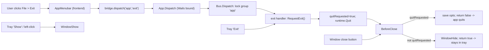

## Overview

Three coordinated pieces:
1. Backend lifecycle: close-to-tray + explicit quit, system tray via `energye/systray`.
2. A grouped command-bus communication structure (Go registry + thin TS client).
3. Frontend shadcn `Menubar` with `File > Exit` that dispatches `app/exit` over the bus.

## Flow



## 1. Command bus (backend)

New package `backend/bus/bus.go`:
- `type HandlerFunc func(ctx context.Context, payload json.RawMessage) (any, error)`.
- `type Bus` holding `map[string]*group`; each `group` has its own `sync.Mutex` + `map[string]HandlerFunc`.
- `Register(group, command string, h HandlerFunc)`.
- `Dispatch(ctx, group, command string, payload json.RawMessage) (any, error)`: looks up the group, locks that group's mutex for the duration of the handler (so calls in the same group serialize / cannot interfere), then runs the handler. Distinct groups run concurrently. Returns a clear error for unknown group/command.

## 2. Wails binding + App changes ([backend/app.go](backend/app.go))

- Add fields to `App`: `bus *bus.Bus`, `quitRequested bool`, `trayIcon []byte`.
- In `NewApp()` build the bus and `registerHandlers()`.
- Add a single bound method:
```go
func (a *App) Dispatch(group string, command string, payloadJSON string) (string, error)
```
  It wraps the payload as `json.RawMessage`, calls `a.bus.Dispatch`, and JSON-marshals the result back to a string (uniform envelope for all future calls).
- `registerHandlers()` registers the `app` group: `exit` -> `a.RequestExit()`, `show` -> `runtime.WindowShow`, `hide` -> `runtime.WindowHide`. (Structure makes adding more groups/commands trivial.)
- `RequestExit()`: set `quitRequested = true`; `runtime.Quit(a.ctx)`.
- Rework `BeforeClose` (currently `return false` at [backend/app.go](backend/app.go) line 31): if `!quitRequested` -> `runtime.WindowHide(ctx)` and `return true` (prevent quit, stay in tray); if `quitRequested` -> `saveWindowOptions(ctx)` and `return false` (allow quit).

## 3. System tray ([backend/tray.go](backend/tray.go), new)

- Add dependency: `go get github.com/energye/systray` (updates [go.mod](go.mod)/`go.sum`).
- `func (a *App) startTray()` called from `Startup` as `go systray.Run(a.onTrayReady, a.onTrayExit)`.
- `onTrayReady`: `systray.SetIcon(a.trayIcon)`, `SetTitle`/`SetTooltip`, add `Show` and `Exit` items; `show.Click(func(){ runtime.WindowShow(a.ctx) })`, `exit.Click(func(){ a.RequestExit() })`; `SetOnClick` -> show window; `SetOnRClick(func(m systray.IMenu){ m.ShowMenu() })`.
- `onTrayExit`: cleanup hook (no-op for now).
- Icon bytes: embed in [main.go](main.go) and pass into the app. On Windows use `build/windows/icon.ico`, otherwise reuse the existing `build/appicon.png`; select by `runtime.GOOS`. Pass into `NewApp` (or set `app.trayIcon`) so `main.go` keeps owning the `//go:embed`.

## 4. Bound bindings for the frontend

Wails regenerates `frontend/wailsjs/go/backend/App.{js,d.ts}` on `wails dev`/`build`. To keep the frontend compiling immediately, also hand-add `Dispatch` to:
- [frontend/wailsjs/go/backend/App.js](frontend/wailsjs/go/backend/App.js)
- [frontend/wailsjs/go/backend/App.d.ts](frontend/wailsjs/go/backend/App.d.ts)

## 5. Frontend command-bus client (new `frontend/src/bridge/`)

- `bridge/dispatch.ts`: `dispatch<TRes = unknown>(group, command, payload?)` -> calls `Dispatch(group, command, JSON.stringify(payload ?? {}))`, parses the JSON string result, returns typed value; wraps errors.
- `bridge/groups/app.ts`: typed group wrapper, e.g. `appBus = { exit: () => dispatch('app','exit'), show: ..., hide: ... }`. New groups get their own file -> mirrors the backend grouping.

## 6. Frontend menu (shadcn)

- New `frontend/src/components/1-header/9-app-menubar.tsx` using existing [frontend/src/ui/shadcn/menubar.tsx](frontend/src/ui/shadcn/menubar.tsx): a `Menubar` with one `MenubarMenu` `File` containing a single `MenubarItem` `Exit` whose `onSelect` calls `appBus.exit()`.
- Render `<AppMenubar />` in [frontend/src/components/1-header/index.tsx](frontend/src/components/1-header/index.tsx), left of the existing title/theme toggle.

## Verification

- `go vet ./...` and `go build` succeed.
- Frontend type-checks/builds (`pnpm --prefix frontend run build`).
- Manual: window close button hides to tray; tray left-click/Show restores; File > Exit and tray Exit both terminate the process.

## Notes / decisions

- Per your choice, the bus serializes per group via a group-level mutex (same-group calls can't interfere; different groups stay concurrent).
- Tray click semantics on Windows in Wails v2 are limited; left-click -> Show, right-click -> menu, which is the reliable pattern.
</plan>
<todos>[{"id": "bus-go", "content": "Create backend/bus/bus.go with Bus, per-group mutex, Register, and Dispatch"}, {"id": "app-go", "content": "Update backend/app.go: bus field, Dispatch bound method, registerHandlers, RequestExit, quitRequested flag, close-to-tray BeforeClose"}, {"id": "tray-go", "content": "Add github.com/energye/systray dep and create backend/tray.go with Show/Exit tray menu; embed/select icon in main.go"}, {"id": "bindings", "content": "Hand-add Dispatch to frontend/wailsjs/go/backend/App.js and App.d.ts"}, {"id": "fe-bridge", "content": "Create frontend/src/bridge/ command-bus client (dispatch + app group)"}, {"id": "fe-menu", "content": "Add shadcn AppMenubar (File > Exit) and render it in the header"}, {"id": "verify", "content": "go vet/build and frontend build; manual tray + exit checks"}]</todos>
</invoke>
