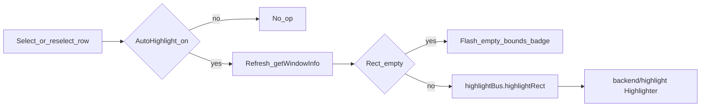

# Window auto-highlight and empty-bounds badge

## Approach

Mirror [win-watch-26-go](C:\y\w\2-web\0-dp\win-watch-26-go)’s highlighter (layered topmost border overlay, 200 ms blinks) as a **separate bus-registered package** in traytools, matching existing modules like [`backend/windowtree`](backend/windowtree/manager.go).

UI follows screenshot 2 for this app:

- **Auto-highlight** toggle between Filter and Options in [`1-tree-toolbar.tsx`](frontend/src/components/2-main/1-tab-windows-tree/1-tree-toolbar.tsx)
- Red **empty bounds** flash badge next to the selected tree row label in [`2-1-tree-node.tsx`](frontend/src/components/2-main/1-tab-windows-tree/2-1-tree-node.tsx)

Highlight appearance is fixed to win-watch frontend defaults for now: color `#ff0000`, border width `2`, blink count `3`. Empty bounds means `width <= 0 || height <= 0` (same check as win-watch; no separate monitor-intersection test).



## Backend: new `backend/highlight` module

Create package following the Manager + Register pattern:

| File | Role |
|------|------|
| [`backend/highlight/manager.go`](backend/highlight/manager.go) | `Group = "highlight"`, commands `highlightRect`, `hide` |
| [`backend/highlight/types.go`](backend/highlight/types.go) | Request payload types |
| [`backend/highlight/highlight_windows.go`](backend/highlight/highlight_windows.go) | Port of win-watch [`highlight.go`](C:\y\w\2-web\0-dp\win-watch-26-go\internal\winwatch\win32\highlight.go) (overlay window, GDI border, blink timer) plus small local helpers (`HWND`, `Rect`, `GetModuleHandle`, `IsWindowVisible`) |
| [`backend/highlight/platform_other.go`](backend/highlight/platform_other.go) | No-op stubs for non-Windows |

Bus API (JSON via existing `App.Dispatch`):

- `highlight` / `highlightRect` — `{ left, top, right, bottom, color, borderWidth, blinkCount }`
- `highlight` / `hide` — hide overlay

Wire in [`backend/app.go`](backend/app.go): `highlight.New()`, store on `App`, `Register(a.bus)`.

Keep the highlighter lazy-initialized (create on first `highlightRect`), same idea as win-watch’s `ensureHighlighter`.

## Frontend bridge

- Add [`frontend/src/bridge/groups/highlight.ts`](frontend/src/bridge/groups/highlight.ts) with `highlightBus.highlightRect(...)` / `hide()`
- Export from [`frontend/src/bridge/index.ts`](frontend/src/bridge/index.ts)

## Frontend state and highlight flow

In [`s-windows-tree-state.ts`](frontend/src/components/2-main/1-tab-windows-tree/s-windows-tree-state.ts):

- `autoHighlightAtom = atomWithStorage("wt.autoHighlight", false)`
- `emptyBoundsFlashTokenAtom` (counter, like win-watch)

In [`a-windows-tree-calls.ts`](frontend/src/components/2-main/1-tab-windows-tree/a-windows-tree-calls.ts) (or a small sibling helper):

- `maybeHighlightSelectedWindow(handle)`:
  1. Skip root / null
  2. `await loadWindowInfo(handle)` for fresh `rect`
  3. If empty → bump flash token (and do not call Go highlight)
  4. Else → `highlightBus.highlightRect` with fixed defaults

Selection wiring in [`2-0-windows-tree.tsx`](frontend/src/components/2-main/1-tab-windows-tree/2-0-windows-tree.tsx):

- On selection change: always `loadWindowInfo`; if auto-highlight on, run highlight path
- On auto-highlight toggle **on**: highlight current selection if any
- On toggle **off**: `highlightBus.hide()`

## Reselect already-selected row

[`kibo-ui-tree.tsx`](frontend/src/ui/shadcn/kibo-ui-tree.tsx) currently returns early when clicking an already-selected node (`deselectOnReselect=false`), so `onSelectionChange` never fires.

Add optional `onReselect?: (nodeId: string) => void` to `TreeProvider` and invoke it in that early-return branch. Wire it from `WindowTreeView` to re-run the highlight path when auto-highlight is enabled.

## UI pieces

**Toolbar** ([`1-tree-toolbar.tsx`](frontend/src/components/2-main/1-tab-windows-tree/1-tree-toolbar.tsx)):

```text
Refresh | Filter | Auto-highlight [Switch] | Options
```

Use existing [`Switch`](frontend/src/ui/shadcn/switch.tsx) + compact label, similar to win-watch’s control-tree header.

**Empty bounds badge** ([`2-1-tree-node.tsx`](frontend/src/components/2-main/1-tab-windows-tree/2-1-tree-node.tsx)):

- After `TreeLabel`, when this node is the selected handle and flash token is active, render animated red pill `empty bounds` (copy motion timing from win-watch: ~1.55s opacity/scale, clear after ~1600ms)
- Uses `motion/react` already present in the app

## Out of scope

- Editable highlight color/width/blink settings UI
- Monitor virtual-screen intersection beyond zero-area detection
- Adding rect data to every `WindowNode` in the tree enumeration
