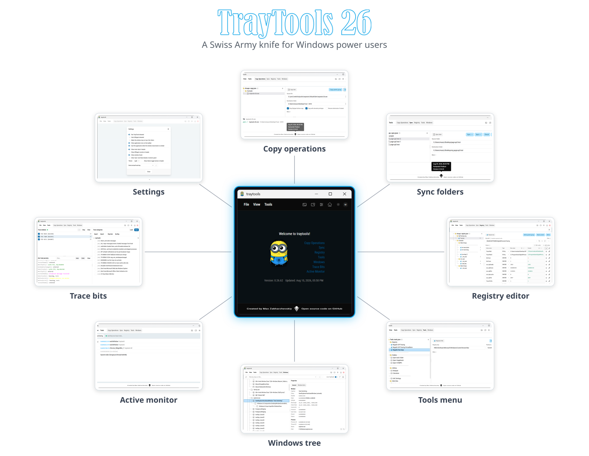

## Table of Contents

- [Introduction](#introduction)
- [Screenshots](#screenshots)
- [Features in detail](#features-in-detail)
  - [Copy Operations](#copy-operations)
  - [Folder Sync](#folder-sync)
  - [Registry Editor](#registry-editor)
  - [Tools Menu](#tools-menu)
  - [Windows Tree](#windows-tree)
  - [Active Monitor](#active-monitor)
  - [Trace Bits](#trace-bits)
  - [Process launching and tracking](#process-launching-and-tracking)
  - [Window behavior: always-on-top and two sizes](#window-behavior-always-on-top-and-two-sizes)
  - [Elevation: raise or drop privileges](#elevation-raise-or-drop-privileges)
  - [Dark and light themes](#dark-and-light-themes)
  - [System tray](#system-tray)
- [JSON formats](#json-formats)
  - [Where the files are loaded from](#where-the-files-are-loaded-from)
  - [copy.json — Copy Operations](#copyjson--copy-operations)
  - [sync.json — Folder Sync](#syncjson--folder-sync)
  - [registry.json — Registry Editor](#registryjson--registry-editor)
  - [tools.json — Tools Menu (JSONC)](#toolsjson--tools-menu-jsonc)
  - [init.json — Application options](#initjson--application-options)
- [Building the project](#building-the-project)
  - [Prerequisites](#prerequisites)
  - [Live development](#live-development)
  - [Production build](#production-build)
- [Additional information](#additional-information)

## Introduction

**Tray Tools 26** is a **Windows-only** desktop utility — a Swiss Army knife for power users, developers, and support engineers. Instead of keeping a dozen small utilities around, you get a single tray-resident app that bundles the everyday tools needed to inspect, tweak, and automate a Windows workstation:

- **Copy Operations** — batched file deployment with a tree editor.
- **Folder Sync** — compare and synchronize folder pairs.
- **Registry Editor** — curated registry tweaks with current vs. new value preview.
- **Tools Menu** — a fully data-driven launcher for programs, folders, URLs, and registry keys.
- **Windows Tree** — a WinSpy-like inspector of every window on the desktop.
- **Active Monitor** — real-time tracking of foreground/active/focus windows.
- **Trace Bits** — live trace-category management for target processes.

The app lives in the system tray, supports **dark and light themes**, can stay **always on top**, collapse into a compact **toolbar view**, and can **raise or drop its own privilege level** (administrator ↔ standard user) on demand.

## Screenshots

Screenshots below are listed in the same order as they appear in the [`frontend/src/assets/previews`](frontend/src/assets/previews) folder.

**1. Dark mode** — every part of the UI, including the Welcome page, is available in a dark color scheme.

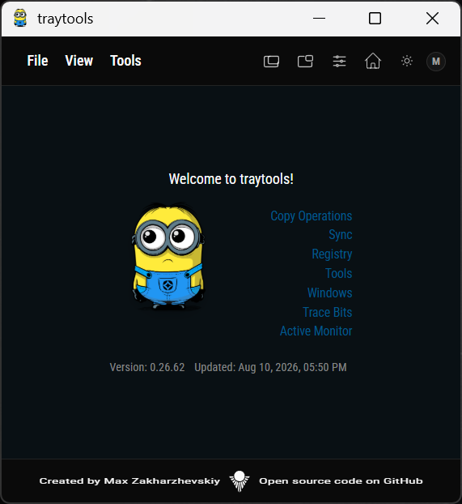

**2. Welcome** — the landing page: app logo, version and build stamps, and quick navigation to every tool.

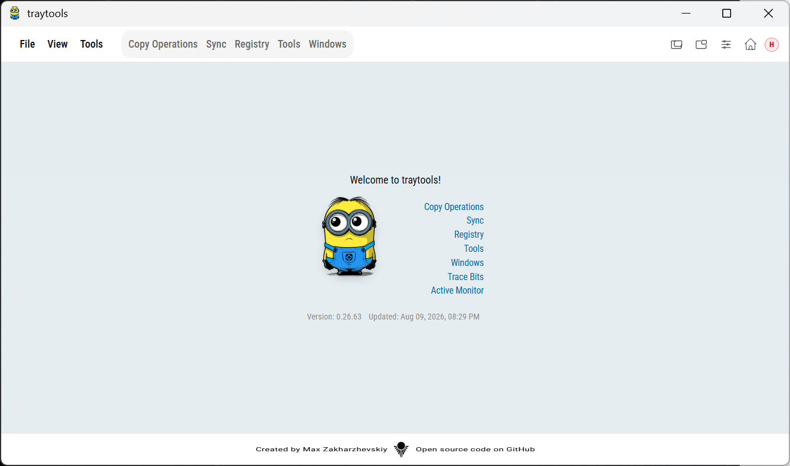

**3. Copy Operations** — a tree editor for batched file copies: groups, nested groups, and separators, each item mapping a source file to a destination folder.

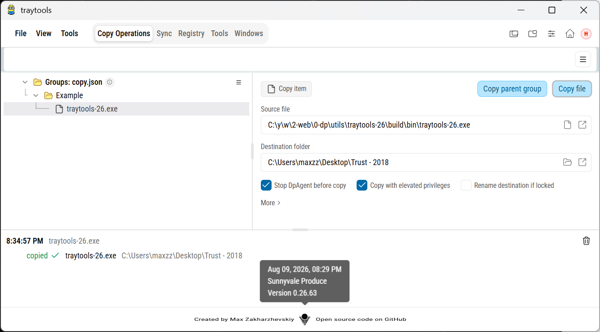

**4. Sync** — folder-pair synchronization: define source/destination pairs, check for differences, then sync with live progress.

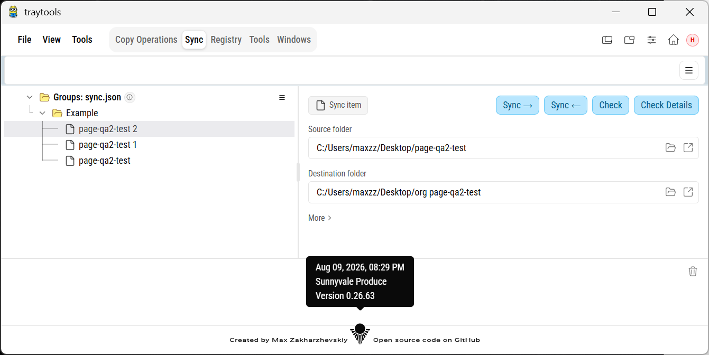

**5. Registry** — a registry tweak editor showing the current value and the new value side by side, with import/export of JSON and Windows `.reg` files.

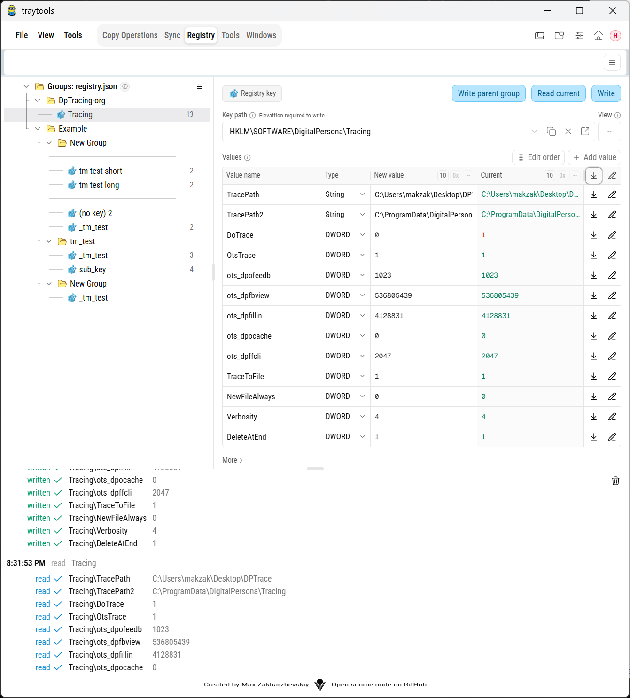

**6. Tools** — the editor for the data-driven Tools menu: commands, sub-menus, separators, hotkeys, and per-item elevation.

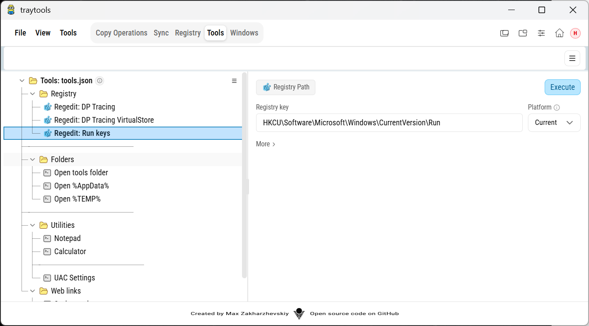

**7. Windows** — a WinSpy-like tree of every HWND on the desktop, with style/process properties and on-screen window highlighting.

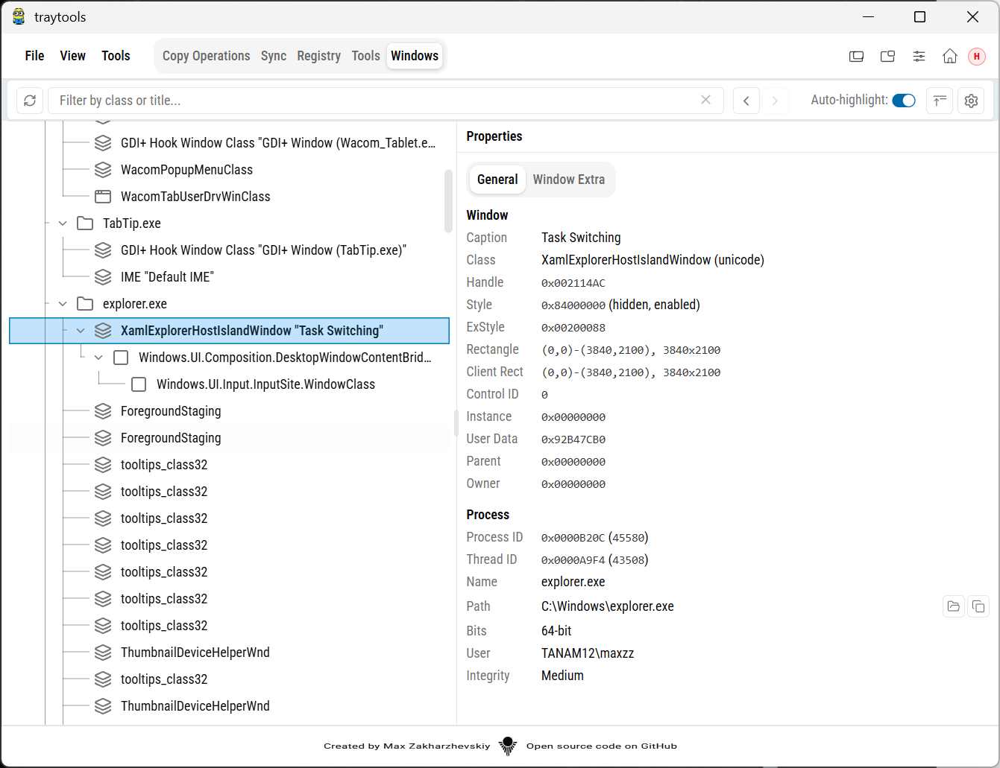

**8. Active Monitor** — real-time tracking of the foreground, active, focus, and capture windows of whatever app you are working in.

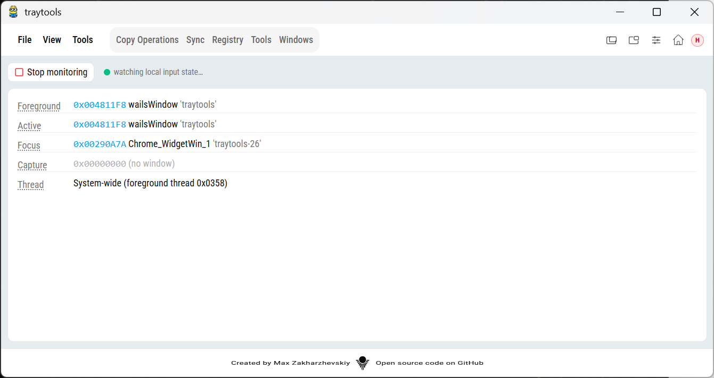

**9. Trace Bits** — manage trace categories (bit flags) per process and watch live trace output.

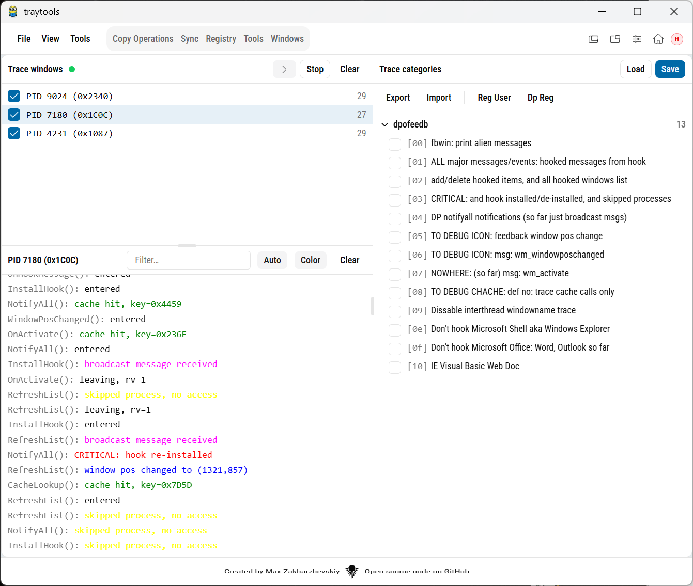

**10. Options** — application settings: theme, always-on-top, elevation, taskbar/tray behavior, hotkeys, and agent integration.

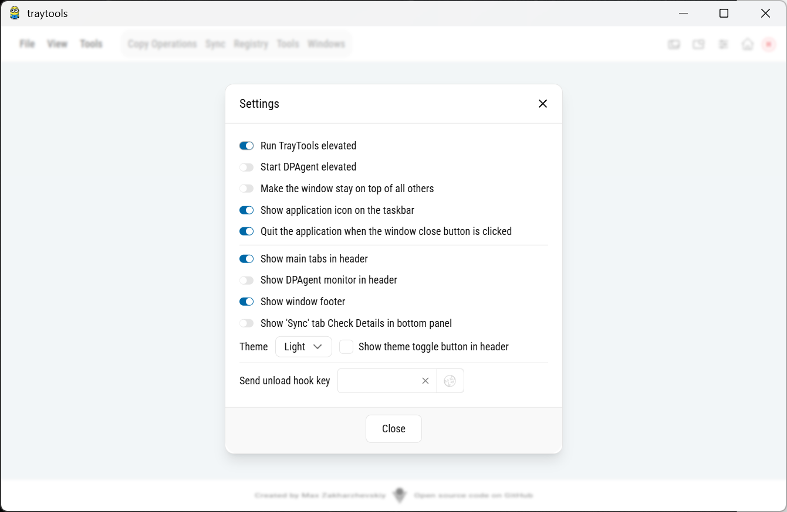

## Features in detail

### Copy Operations

Designed for repetitive file deployment (for example, dropping freshly built binaries into a test folder).

- Operations are organized as a tree: **groups**, **nested groups**, **separators**, and **items** (`sourceFile` → `destFolder`).
- Per-group and per-item execution flags:
  - `stopDpAgent` — stop the DPAgent service before copying (avoids locked files).
  - `requireElevated` — run the copy with administrator privileges.
  - `renameLocked` — if the destination file is locked, rename it instead of failing.
- After a run, every item is reported as copied, skipped, failed, or renamed.
- The tree is stored as plain JSON (`copy.json`), so it can be edited in the UI or by hand.

### Folder Sync

One-way mirror of a source folder onto a destination: new and changed files are copied; files that exist only on the destination are moved to the Recycle Bin.

- Define **folder pairs** (`sourceFolder` ↔ `destFolder`) organized in groups.
- **Check** compares the two trees (by file size and modification time) and shows adds / modifies / deletes without touching anything.
- **Sync** applies those differences with per-file progress events. File metadata is preserved.
- A pair can be given two named directions (`forwardName` / `reverseName`), e.g. *"git to test"* and *"test to git"*.

**Folders and files that are not copied** (also left untouched on the destination):

- Each sync item has a **skip list** of regular expressions. Check and Sync skip any file or folder whose **name** or **relative path** matches a pattern (paths use `/`). Matching folders are not entered, so their contents are neither copied nor deleted.
- **`skipPatterns` in `sync.json`:**
  - *omitted* (legacy files) — skip `^\.git$` and `^node_modules$` at any depth.
  - `[]` — skip nothing; every file is copied / compared.
  - any other array — those patterns. If the list is only the two defaults, the field is not written back.

Source and destination must be different paths and neither may contain the other.

### Registry Editor

A curated, repeatable way to apply registry tweaks (tracing flags, feature switches, etc.).

- Keys and values are shown as a tree with the **current value** read live from the registry next to the **new value** you want to apply — you always see exactly what will change.
- Values can be applied selectively, and multiple values per key are supported.
- Supported types: `REG_SZ`, `REG_EXPAND_SZ`, `REG_DWORD`, `REG_QWORD`, `REG_BINARY`, `REG_MULTI_SZ`.
- **Import/export** works both with the app's own JSON format and with standard Windows **`.reg`** files (`Windows Registry Editor Version 5.00`, also accepts `REGEDIT4`, `dword:`/`hex:` notations, line continuations). Deletion entries (`[-KEY]`, `"name"=-`) are skipped with a warning.

### Tools Menu

The header **Tools** menu is fully data-driven from `tools.json` — edit the file and reopen the menu, no restart required.

- Launch **executables** and **URLs**, open **folders** in Explorer, or jump **Regedit** directly to a key (`HKLM\...`), even when Regedit is already running.
- Supports nested **sub-menus** (any depth), **separators** (`"menuName": "-"`), **hotkey labels**, and per-item **elevation** (`runElevated`).
- `%VAR%` environment variables are expanded; paths with spaces are handled without quotes (longest existing path prefix wins).
- The full format reference lives in [tools/tools.md](tools/tools.md).

### Windows Tree

- Enumerates the entire desktop HWND tree like WinSpy.
- Filter the tree, group windows by process, and inspect style and process properties: executable path, command line, bitness, user name, and integrity level.
- Selecting a window can **highlight it on screen** with an overlay frame.

### Active Monitor

- Polls the Win32 input state every 500 ms and reports the **Foreground**, **Active**, **Focus**, and **Capture** windows — handle, class name, title, process/thread IDs.
- The backend attaches to the foreground thread's input state, so the values reflect the application *you* are interacting with, not Tray Tools itself (a modern take on the legacy `liswatch` utility).

### Trace Bits

- Per-process trace windows with a live trace stream.
- Trace categories are toggled as **bit flags** via checkboxes, making it easy to enable exactly the tracing you need.

### Process launching and tracking

- Specific processes are launched from the **Tools menu** (with optional arguments, hotkeys, and elevation) and from the header **DPAgent toolbar** (start/stop with integrity-level control).
- Launch status and window state can then be observed in the **Windows Tree** (process path, command line, integrity) and tracked in real time in the **Active Monitor**.

### Window behavior: always-on-top and two sizes

- **Always on top**: a single switch keeps the main window above all other windows — handy when the app is used as a desktop companion next to the program you are debugging.
- **Two window sizes**, toggled from the header:
  - **Toolbar (mini) view** — a compact strip (default 480×72) that keeps the toolbar and agent controls visible while the main content is hidden.
  - **Normal view** — the full UI at a user-defined size; the geometry you choose is remembered.
- Both sizes (and which one is active) are persisted in `init.json`, and the UI also supports zoom controls.

### Elevation: raise or drop privileges

- **Request administrator rights**: from Settings (or automatically at startup via `runElevated` in `init.json`) the app relaunches itself through `ShellExecute` with the `runas` verb, then exits the non-elevated instance.
- **Downgrade**: an elevated instance can relaunch itself at standard user level by spawning the new process as a child of Windows Explorer, so it inherits Explorer's medium integrity instead of the elevated parent's high integrity.
- Individual Tools-menu commands can also be marked `runElevated` without elevating the whole app.

### Dark and light themes

The entire UI supports both **dark and light color schemes** (see the first screenshot). The theme can be switched in Settings and is persisted across runs.

### System tray

- The app is tray-first: it starts hidden and lives in the system tray ("Tray Tools").
- **Left-click** the tray icon to show/hide the window; **right-click** for a menu with Show/Hide and Exit.
- Optionally the taskbar button can be hidden while the tray icon remains, and the close button can be configured to either quit the app or hide it to the tray.

## JSON formats

All editors in the app load and save plain JSON files, so configurations can be version-controlled and edited by hand.

### Where the files are loaded from

For each editor config the first existing file wins:

1. An environment variable override: `TRAYTOOLS_COPY`, `TRAYTOOLS_SYNC`, `TRAYTOOLS_REGISTRY`, or `TRAYTOOLS_TOOLS`.
2. `<exeDir>\tools\<file>`, then `<exeDir>\<file>` — next to the executable.
3. `.\tools\<file>`, then `.\<file>` — the current working directory (this is what `wails dev` uses from the project root).
4. `%AppData%\traytools-26-go\tools\<file>` — the per-user config directory (default write location).

Ready-to-use samples of every file below live in the [tools](tools) folder of this repository.

### copy.json — Copy Operations

Groups contain items (or nested groups and separators). Item/group flags are only written when `true`.

```json
{
    "groups": [
        {
            "name": "Deploy",
            "items": [
                {
                    "sourceFile": "C:/work/app/build/app.exe",
                    "destFolder": "C:/work/app-test",
                    "name": "app.exe",
                    "stopDpAgent": true,
                    "requireElevated": true,
                    "renameLocked": true
                },
                { "separator": true, "comment": "docs" },
                {
                    "sourceFile": "C:/work/app/README.md",
                    "destFolder": "C:/work/app-test"
                }
            ]
        }
    ]
}
```

### sync.json — Folder Sync

Optional per-item `skipPatterns` is an array of regular expressions.

- Omit the field to keep the legacy skip of `^\.git$` and `^node_modules$`.
- Use `"skipPatterns": []` to copy and compare every file.
- The two default patterns are never written back; only an empty or custom list is stored.

```json
{
    "groups": [
        {
            "name": "Example",
            "items": [
                {
                    "sourceFolder": "C:/work/app",
                    "destFolder": "C:/work/app-test",
                    "forwardName": "git to test",
                    "reverseName": "test to git"
                }
            ]
        }
    ]
}
```

### registry.json — Registry Editor

Each item targets one key (`keyPath`) and lists the values to set. `valueType` is one of
`REG_SZ`, `REG_EXPAND_SZ`, `REG_DWORD`, `REG_QWORD`, `REG_BINARY`, `REG_MULTI_SZ`.

```json
{
    "groups": [
        {
            "name": "DpTracing",
            "items": [
                {
                    "keyPath": "HKLM\\SOFTWARE\\DigitalPersona\\Tracing",
                    "values": [
                        { "valueName": "TracePath", "valueType": "REG_SZ",    "newValue": "C:\\DPTrace" },
                        { "valueName": "DoTrace",   "valueType": "REG_DWORD", "newValue": "0" }
                    ]
                }
            ]
        }
    ]
}
```

The same data can be imported from / exported to standard Windows `.reg` files:

```reg
Windows Registry Editor Version 5.00

[HKEY_LOCAL_MACHINE\SOFTWARE\DigitalPersona\Tracing]
"DoTrace"=dword:00000000
```

### tools.json — Tools Menu (JSONC)

The Tools menu accepts `//` and `/* … */` comments and tolerates trailing commas.
A node is a **separator** (`"menuName": "-"`), a **sub-menu** (has `menuItems`), or a **command** (has `cmdLine`).
`cmdWhat` selects how `cmdLine` is interpreted: `rel` (relative to the config folder), `abs` (absolute path or URL), or `reg` (registry key to open in Regedit).

```json
{
    "menu": {
        "menuName": "Tools",
        "menuItems": [
            {
                "menuName": "Notepad",
                "cmdLine": "notepad.exe",
                "cmdWhat": "abs",          // rel | abs | reg
                "cmdPlat": "curr",         // curr | 32 | 64 | both
                "hotKey": "Ctrl+Alt+T",
                "runElevated": false
            },
            { "menuName": "-" },
            {
                "menuName": "Regedit: DP Tracing",
                "cmdLine": "HKLM\\SOFTWARE\\DigitalPersona\\Tracing",
                "cmdWhat": "reg"
            },
            {
                "menuName": "Sysinternals",
                "cmdLine": "https://learn.microsoft.com/sysinternals/",
                "cmdWhat": "abs"
            }
        ]
    }
}
```

See [tools/tools.md](tools/tools.md) for the complete field reference.

### init.json — Application options

Stored at `%AppData%\traytools-26-go\init.json`; normally written by the app itself, but useful to know:

```json
{
    "bounds":  { "x": 100, "y": 100, "width": 1200, "height": 800 },
    "windowSizeKey": "normal",
    "windowSizes": {
        "normal": { "x": 100, "y": 100, "width": 1200, "height": 800 },
        "mini":   { "x": 100, "y": 100, "width": 480,  "height": 72 }
    },
    "runElevated": false,
    "quitOnClose": false,
    "showInTaskbar": true,
    "unloadHookHotkey": "",
    "zoomLevel": 0
}
```

- `windowSizeKey` / `windowSizes` — the active size mode (`normal` or the `mini` toolbar strip) and the remembered geometry of each.
- `runElevated` — relaunch as administrator on startup.
- `quitOnClose` / `showInTaskbar` — tray and close-button behavior.
- UI preferences (theme, always-on-top, panel layout, tab visibility) are stored separately in the WebView local storage under the `traytools-26__v1.0` key.

## Building the project

### Prerequisites

| Tool | Version |
| ---- | ------- |
| Go | 1.22+ |
| Wails CLI | v2.12 (`go install github.com/wailsapp/wails/v2/cmd/wails@latest`, or run [scripts/install-wails-cli.sh](scripts/install-wails-cli.sh)) |
| Node.js + pnpm | any recent LTS |
| Windows WebView2 Runtime | preinstalled on Windows 10/11 |

### Live development

From the project root:

```shell
wails dev
```

This starts the Go backend with hot reload and the Vite dev server for the frontend (the scripts in `wails.json` use `pnpm`). You can also run the frontend standalone in a browser:

```shell
cd frontend
pnpm install
pnpm dev        # http://localhost:34115
```

### Production build

```shell
wails build
```

or the packaged script [scripts/build-windows.sh](scripts/build-windows.sh):

```shell
wails build --clean --platform windows/amd64 -debug -devtools -ldflags "-H windowsgui"
```

The redistributable binary is produced at **`build/bin/traytools-26.exe`** — a single self-contained executable with the frontend assets embedded. Sample configurations from the `tools/` folder can be placed next to the executable (see [Where the files are loaded from](#where-the-files-are-loaded-from)).

## Additional information

- **Platform: Windows only.** The app relies on Windows-specific APIs throughout: the registry, HWND window enumeration, input-state monitoring, UAC elevation/integrity levels, the system tray, and the WebView2 runtime.
- **Tech stack**: Go 1.22 + [Wails v2.12](https://wails.io) on the backend; React 19, TypeScript, Vite, Tailwind CSS 4, shadcn/ui, and Jotai on the frontend.
- **Config location**: `%AppData%\traytools-26-go\` (`init.json`, `tools\*.json`).
- **Sample configs**: the [tools](tools) folder contains working `copy.json`, `sync.json`, `registry.json`, `tools.json`, and a `.reg` example, plus the [Tools-menu format reference](tools/tools.md).
- **Hero image**: the banner at the top is a single self-contained SVG ([2026,08.10.26_1_hero_welcome.svg](frontend/src/assets/previews/2026,08.10.26_1_hero_welcome.svg)) with a transparent background — its text and frames adapt to the viewer's light/dark theme via `prefers-color-scheme`, and the screenshots are embedded as scaled base64 copies (external image links would be blocked by GitHub's CSP). Regenerate it after updating the screenshots with `powershell -File scripts/build-hero-image.ps1`.
- **Author**: Max Zakharzhevskiy (<maxzz@msn.com>).
